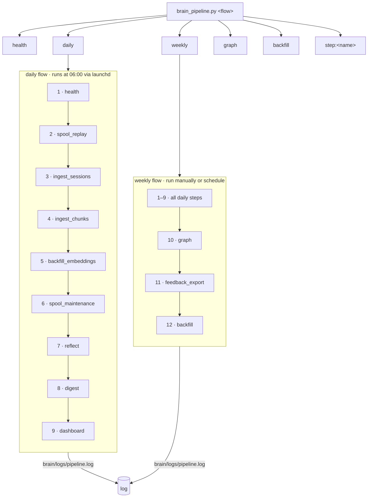

# Brain Pipeline

`brain/tools/brain_pipeline.py` is the central automation runner for the brain system. It chains all brain tools into named **flows** executed step-by-step, with per-step timing, logging, and failure isolation.

> [!tip] Quick start
> ```bash
> python3 brain/tools/brain_pipeline.py daily
> ```

---

## Architecture



---

## Flows

### `health`
Quick liveness check. Aborts immediately if the API is unreachable.

| # | Step | Critical |
|---|------|----------|
| 1 | health | yes |

### `daily`
Runs every day at **06:00** via launchd (`com.brain.pipeline.daily`).

| # | Step | What it does |
|---|------|-------------|
| 1 | `health` | `GET /health` — confirms brain_api is up |
| 2 | `spool_replay` | Flush any writes queued during API downtime |
| 3 | `ingest_sessions` | Ingest new Claude Code sessions (`07_ingest_claude_code.py --no-llm`) |
| 4 | `ingest_chunks` | Chunk raw session transcripts into conversation memories (`ingest_session_chunks.py --all`) |
| 5 | `backfill_embeddings` | Embed any `memories` rows with `NULL` embedding via Rust ONNX backfill binary |
| 6 | `spool_maintenance` | Prune spool entries older than 14 days |
| 7 | `reflect` | `POST /reflect` — LLM consolidates near-duplicate memories |
| 8 | `digest` | Append new feedback events to daily markdown digest |
| 9 | `dashboard` | Refresh `dashboards/brain-dashboard-data.json` for Obsidian |

### `weekly`
All daily steps plus heavier tasks. Run manually or wire a separate launchd plist.

| # | Step | What it does |
|---|------|-------------|
| 1–9 | *(daily)* | All steps above |
| 10 | `graph` | Re-export full knowledge graph to `brain-graph/` (1 400+ notes) |
| 11 | `feedback_export` | Export last 7 days of feedback events to JSONL |
| 12 | `backfill` | Catch-up ingest from all sources via `backfill_orchestrator.py` |

### `graph`
Health check + knowledge graph export only.

### `backfill`
Health check + full `backfill_orchestrator.py` run.

### `step:<name>`
Run any single step in isolation.

```bash
python3 brain/tools/brain_pipeline.py step:reflect
python3 brain/tools/brain_pipeline.py step:graph
python3 brain/tools/brain_pipeline.py step:ingest_sessions
```

---

## Step reference

| Step | Tool / endpoint | Timeout | Critical |
|------|----------------|---------|----------|
| `health` | `GET /health` | 5s | **yes** |
| `spool_replay` | `replay_spool.py` | 5m | no |
| `ingest_sessions` | `07_ingest_claude_code.py --no-llm` | 10m | no |
| `ingest_chunks` | `ingest_session_chunks.py --all` | 10m | no |
| `backfill_embeddings` | `brain_backfill_embeddings` (Rust binary) | 5m | no |
| `spool_maintenance` | `spool_maintenance.py` | 5m | no |
| `reflect` | `POST /reflect` (60s timeout) | 60s | no |
| `digest` | `feedback_digest.py` | 5m | no |
| `dashboard` | `export_metrics_obsidian.py` | 5m | no |
| `graph` | `export_knowledge_graph.py` | 15m | no |
| `feedback_export` | `export_feedback.py --since-days 7` | 1m | no |
| `backfill` | `backfill_orchestrator.py --no-llm` | 15m | no |

> [!info] Failure isolation
> Only `health` is **critical** — a failure aborts the pipeline. All other steps are soft: a failure is logged and the pipeline continues to the next step.

---

## Output

Every step prints a timestamped line:

```
2026-04-08T15:38:35Z  [pipeline] daily — 7 step(s)
2026-04-08T15:38:35Z  [1/7] health ................ ok    0.0s  ({"status":"ok"})
2026-04-08T15:38:35Z  [2/7] spool_replay .......... ok    0.1s  (replayed=0 remaining=0)
2026-04-08T15:38:54Z  [3/7] ingest_sessions ....... ok   18.7s  (Saved: 184. Rust memories: 1415 → 1599)
2026-04-08T15:38:54Z  [4/7] spool_maintenance ..... ok    0.2s
2026-04-08T15:39:21Z  [5/7] reflect ............... ok   17.0s  (consolidated=2 deleted=0)
2026-04-08T15:39:21Z  [6/7] digest ................ ok    0.1s
2026-04-08T15:39:24Z  [7/7] dashboard ............. ok    2.3s  (dashboards/brain-dashboard-data.json)
2026-04-08T15:39:24Z  [pipeline] daily done — 7/7 ok (38.1s)
```

Logs are appended to `brain/logs/pipeline.log` and `brain/logs/pipeline.err`.

---

## Scheduling

### Daily (already active)

Loaded via launchd as `com.brain.pipeline.daily` — fires at **06:00** every day.

```bash
# Check status
launchctl list | grep brain.pipeline

# Run manually right now
launchctl start com.brain.pipeline.daily

# Unload if needed
launchctl unload ~/Library/LaunchAgents/com.brain.pipeline.daily.plist
```

Plist: `~/Library/LaunchAgents/com.brain.pipeline.daily.plist`

### Weekly (manual for now)

```bash
python3 brain/tools/brain_pipeline.py weekly
```

To schedule, duplicate the daily plist, change the label to `com.brain.pipeline.weekly`, change the argument to `weekly`, and set `Weekday: 0` (Sunday) in `StartCalendarInterval`.

---

## Adding a new step

1. Write a `step_<name>() -> str | None` function in `brain_pipeline.py`
2. Add it to `ALL_STEPS` dict
3. Add the key to whichever flow(s) need it in `FLOWS`

```python
# Example
def step_my_tool() -> str:
    out = _run_script("brain/tools/my_tool.py")
    return out.strip()[:80]

ALL_STEPS["my_tool"] = Step("my_tool", step_my_tool, critical=False)
FLOWS["daily"].append("my_tool")
```

---

## Related

- [[BRAIN]] — full brain system overview
- [[PHASE6_MIGRATION]] — data migration runbook
- [[PHASE7]] — feedback events and observability
- [[BACKFILL_AUTOMATION]] — backfill orchestrator details
- [[deploy/README]] — brain_api supervision and runbook
- `brain/tools/brain_pipeline.py` — source
- `~/Library/LaunchAgents/com.brain.pipeline.daily.plist` — launchd schedule


<!-- brain-linker -->
## Related
- [[brain-graph/conversation/User]]
- [[brain-graph/conversation/User nice. now we need to automate flows, making system chai]]
- [[brain-graph/pattern/Ran command sleep 90 && cat tmpbooks_ingest2.log 2devnull &&]]
- [[brain-graph/solution/Edited Usersmacm1airDocumentsAIbrainbootstrap09_ingest_obsid]]
- [[brain-graph/pattern/Ran command sleep 120 && tail -30 tmpbooks_ingest2.log 2devn]]
- obsidian://open?vault=AI&file=brain%2Fbootstrap%2FPENDING_TASKS
<!-- /brain-linker -->
