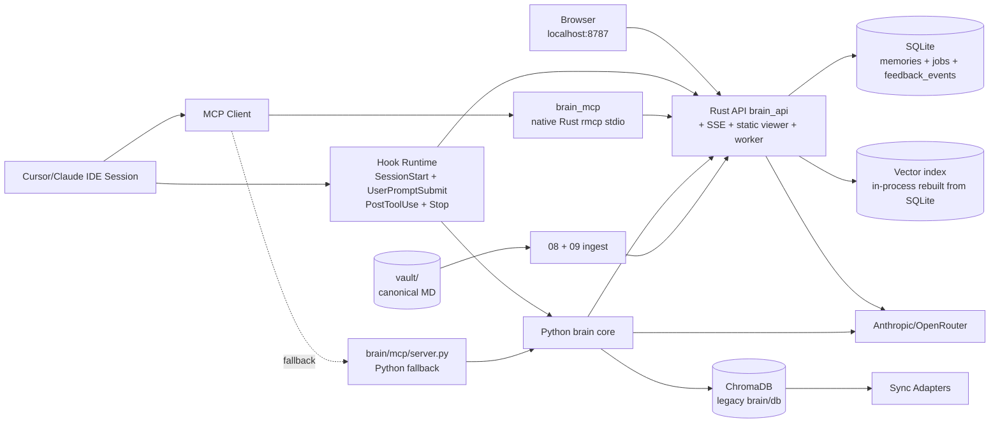
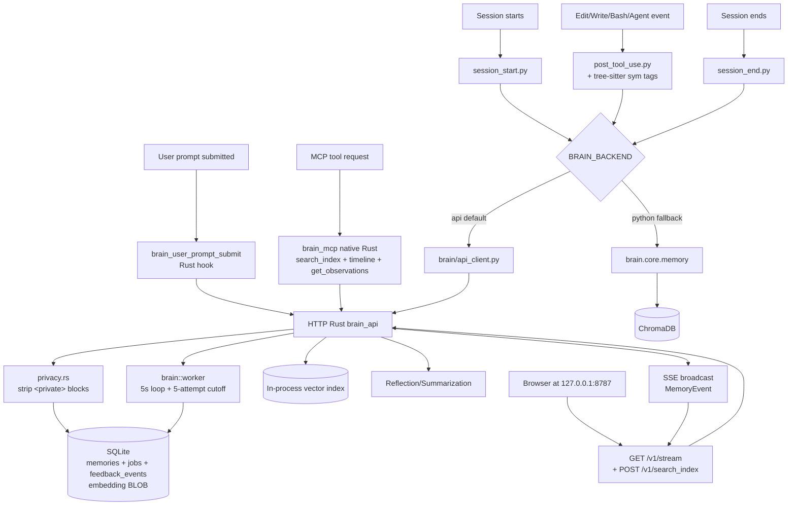
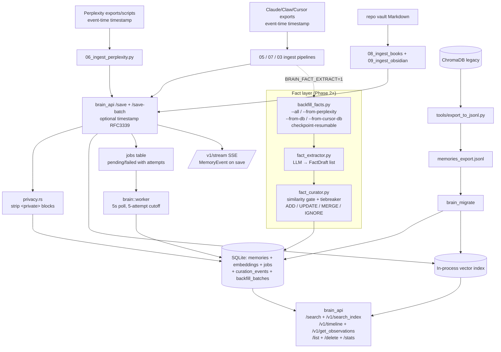
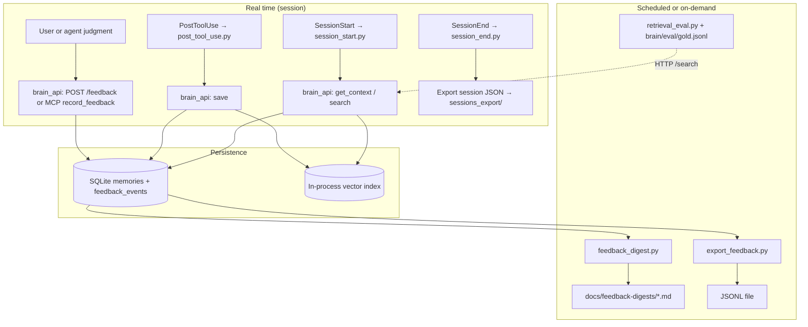
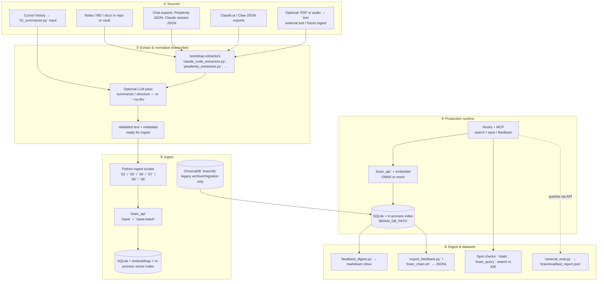
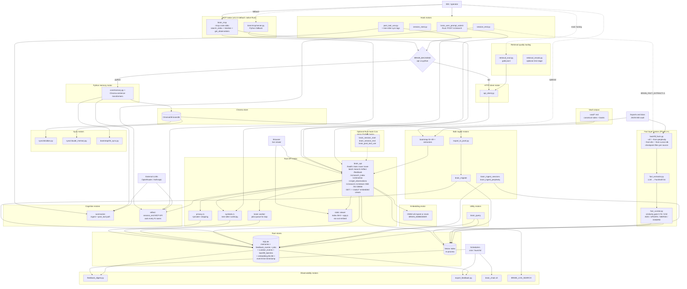

# System Diagrams

This document captures the brain system architecture in several views:

1. System context (actors and major components)
2. Runtime flow (how requests move during normal operation)
3. Data and storage flow (ingest, migration, and persistence)
4. End-to-end chain (real time → scheduled → review)
5. **Import → transcribe/extract → ingest → production → digest** (below)
6. **Unified motor map** — all major processes on one diagram + inventory (below)

**Storage note (Rust primary):** `brain_api` keeps vectors **in memory** (cosine index) and rebuilds from SQLite (`memories.embedding` BLOB + metadata) on startup. Some deploy docs still mention `BRAIN_INDEX_PATH` / `.bin` for backup or older layouts; the diagrams below emphasize **SQLite + in-process index** unless labeled otherwise.

**v0.2.0 (2026-04-20) changes reflected below:** native Rust MCP (`brain_mcp`) replaces the Python stdio wrapper as default; new `UserPromptSubmit` hook (`brain_user_prompt_submit`); tree-sitter symbol tags on PostToolUse; 3-layer progressive-disclosure tools (`search_index` → `timeline` → `get_observations`); SSE broadcast on save (`/v1/stream`); embedded web viewer (`GET /`, `/static/*`); admin endpoints (`/list`, `/delete`); `<private>` block stripping on save; job retry queue (`jobs` table + `brain::worker`); event-time `timestamp` field on `/save`. Full summary: `docs/BRAIN_V0.2.0_CAPABILITIES.md`.

**Fact layer (Phase 2+, 2026-05):** `brain/ingest/fact_extractor.py` + `brain/ingest/fact_curator.py` add a structured fact pipeline on top of raw memories. `brain/tools/backfill_facts.py` runs it across all historical sources (Claude Code sessions, Perplexity threads, Obsidian DB entries, Cursor vscdb) with per-source checkpoint files. Live per-session extraction opt-in via `BRAIN_FACT_EXTRACT=1` in `session_end.py`. New SQLite tables: `curation_events`, `backfill_batches`.

**Roadmap (Rust as sole production brain):** `docs/plans/2026-04-08-rust-primary-production-ready.md`

---

## 1) System Context

---

## 2) Runtime Flow

---

## 3) Data and Storage Flow

---

## 4) End-to-end chain (real time → scheduled → review)

Single story: **capture while you work**, **surface deltas on a schedule**, **export when you need raw data** (e.g. Phase 8).

**Order of operations (conceptual):**

1. **Run** `brain_api` (if `BRAIN_BACKEND=api`) with env for DB/index/key.  
2. **Wire** Claude/Cursor hooks + MCP once.  
3. During work: **context → save → optional feedback** hit SQLite continuously.  
4. **Daily (or manual):** `feedback_digest.py` → markdown inbox.  
5. **When needed:** `export_feedback.py` (or `brain/tools/brain_chain.sh`) → JSONL for analysis / Phase 8.

---

## 5) Production path: import documents -> memory -> digest

How **external knowledge** becomes **searchable memory**, then **operational review** artifacts. "Transcribe" here means **turn raw files or exports into clean text + metadata** (extractors, optional LLM summarize); dedicated audio/PDF pipelines are usually upstream unless you add a converter step.

**Production-ready checklist (conceptual):**

| Step | Goal |
|------|------|
| ① | Single **source of truth** per corpus (export format known, paths stable). |
| ② | **Text is UTF-8 text** with minimal junk; metadata (project, type, source, optional `file_path` / `title` for vault rows) is set before or during ingest. |
| ③ | Ingest scripts write to **Rust API** (`/save` or `/save-batch`) as default production sink. Chroma remains for legacy export/migration only. |
| ④ | **`brain_api` running** with matching `BRAIN_DB_PATH` (and optional index path if your deploy uses on-disk index); hooks/MCP pointed at same backend. |
| ⑤ | **Feedback + digest** on a schedule or runbook so operators see new signal without ad-hoc SQL. |

**Shortcuts:** Greenfield Rust-only users can skip Chroma entirely. Legacy users can keep migration tooling only as archive/rehydration path.

---

## 6) Unified motor map (all major processes)

Single view of **every motor group** the brain uses: entry points, routing, storage, bulk pipelines, cognition, observability, sync, and utilities. Arrows are **primary data/control flow** (some optional paths are omitted for clarity—see inventory).

### Motor / process inventory (by artifact)

| Group | Processes |
|-------|-----------|
| **Hooks** | `brain_user_prompt_submit` (Rust, v0.2.0+), `session_start.py`, `post_tool_use.py`, `session_end.py` |
| **MCP (primary)** | `brain_mcp` — native Rust (`rmcp` crate) stdio server; 3-layer tools: `search_index`, `timeline_tool`, `get_observations_tool` (plus legacy `search_brain` / `save_memory_tool` / `get_context_tool` / `reflect_tool` / `get_stats_tool` / `record_feedback`) |
| **MCP (fallback)** | `brain/mcp/server.py` — retained Python stdio wrapper (`BRAIN_BACKEND=python`, manual QA) |
| **Client** | `brain/api_client.py` (incl. `list_memories`, `delete_memories`, optional `timestamp` kwarg on `save_memory`) |
| **Rust API** | `brain_api` — routes: `/health`, `/stats`, `/save`, `/save-batch`, `/search`, `/reflect`, `/feedback`, `/v1/search`, `/v1/search_index`, `/v1/timeline`, `/v1/get_observations`, `/v1/stream` (SSE), `/list`, `/delete`, `GET /` + `/static/*` (embedded viewer) |
| **Rust ingest** | `brain_migrate`, `brain_ingest_sessions`, `brain_ingest_perplexity` |
| **Rust hook CLIs** | `brain_user_prompt_submit` (default on), `brain_session_start`, `brain_session_end`, `brain_post_tool_use` (+ tree-sitter sym tags) |
| **Rust utility** | `brain_query` |
| **Rust internals (new in v0.2.0)** | `privacy.rs` (`<private>` stripping), `symbols.rs` (tree-sitter rust/ts/py), `worker.rs` (jobs queue, 5s loop, 5-attempt cutoff) |
| **Python core** | `brain/core/memory.py`, `brain/core/db.py`, `brain/core/embedder.py`, `brain/core/summarizer.py` |
| **Bootstrap / extract** | `02_summarize.py`, `03_ingest.py`, `05_ingest_claw.py`, `06_ingest_perplexity.py`, `07_ingest_claude_code.py`, `08_ingest_books.py`, `09_ingest_obsidian.py`, `*_extractors.py`, `parse_sql.py` |
| **Fact layer** | `brain/ingest/fact_extractor.py` (LLM → `FactDraft` list), `brain/ingest/fact_curator.py` (similarity gate: >0.92 IGNORE, 0.78–0.92 tiebreaker, <0.78 ADD; writes `curation_events` + `backfill_batches`), `brain/tools/backfill_facts.py` (4 modes: `--all`, `--from-perplexity`, `--from-db`, `--from-cursor-db`; checkpoint-resumable per source; opt-in live via `BRAIN_FACT_EXTRACT=1`) |
| **Tools** | `export_to_jsonl.py`, `export_feedback.py`, `feedback_digest.py`, `brain_chain.sh`, `retrieval_eval.py`, `retrieval_rerank.py` (optional second-stage rerank; not wired into MCP by default) |
| **Sync** | `sync/obsidian.py`, `sync/claude_memory.py`, `04_sync.py` |
| **Embedding runtime** | ONNX under `brain/rust/models/…` or mock; tokenization inside Rust crate |
| **Stores** | SQLite (metadata + embedding BLOB + `jobs` + `feedback_events` + `curation_events` + `backfill_batches`, event-time `timestamp` field) + in-process vector index on `brain_api` (primary); ChromaDB (legacy/archive) |
| **Observability** | Embedded web viewer (`brain/rust/static/index.html` + `app.js`) served at `http://127.0.0.1:8787/`; SSE stream on `/v1/stream`; `feedback_digest.py` markdown inbox; `BRAIN_LOG_SEARCH` |
| **Vault + eval** | `vault/` corpus; `09`/`08` ingest; `brain/tools/retrieval_eval.py`, `retrieval_rerank.py`, `brain/eval/gold.jsonl` |

**Not drawn as separate boxes:** rate limiting and auth inside `brain_api`; idempotency on feedback; `continual-learning` / `AGENTS.md` (meta, not runtime). **Retrieval eval** (`brain/eval/gold.jsonl` + `brain/tools/retrieval_eval.py`) and **heuristic rerank** (`brain/tools/retrieval_rerank.py`) exist as tooling; default MCP search still uses API vector order unless you add a second-stage call. **Web viewer auth caveat:** `/static/*` is public but `/v1/stream` and `/v1/search_index` require auth — the browser can't send an API key, so set `BRAIN_API_AUTH_REQUIRED=0` for local viewer use only.

---

## Notes

- Runtime path supports `api` (default production) and `python` (legacy fallback) via `BRAIN_BACKEND`.
- Production guardrail can force API path: `BRAIN_ENFORCE_API_ONLY=1`.
- Data migration from ChromaDB to Rust storage is implemented and idempotent.
- **`retrieval_rerank.py`** is a library helper; wire it after `api_client.search` if you want heuristic reordering in a custom tool or MCP fork—default MCP uses raw API order.
- This document is architecture-level and intentionally omits low-level module internals.

<!-- brain-linker -->
## Related
- [[brain-graph/conversation/User]]
- [[brain-graph/conversation/User i want to verify what kind of strong features would thi]]
- [[brain-graph/solution/Edited Usersmacm1airDocumentsAIbrainrustsrcbrain.rs pub stru]]
- [[brain-graph/pattern/Edited Usersmacm1airDocumentsAIbrainrustsrcbrain.rs ( memori]]
- [[brain-graph/solution/Edited Usersmacm1airDocumentsAIbrainrustsrcbrain.rs Ok(Self ]]
<!-- /brain-linker -->
